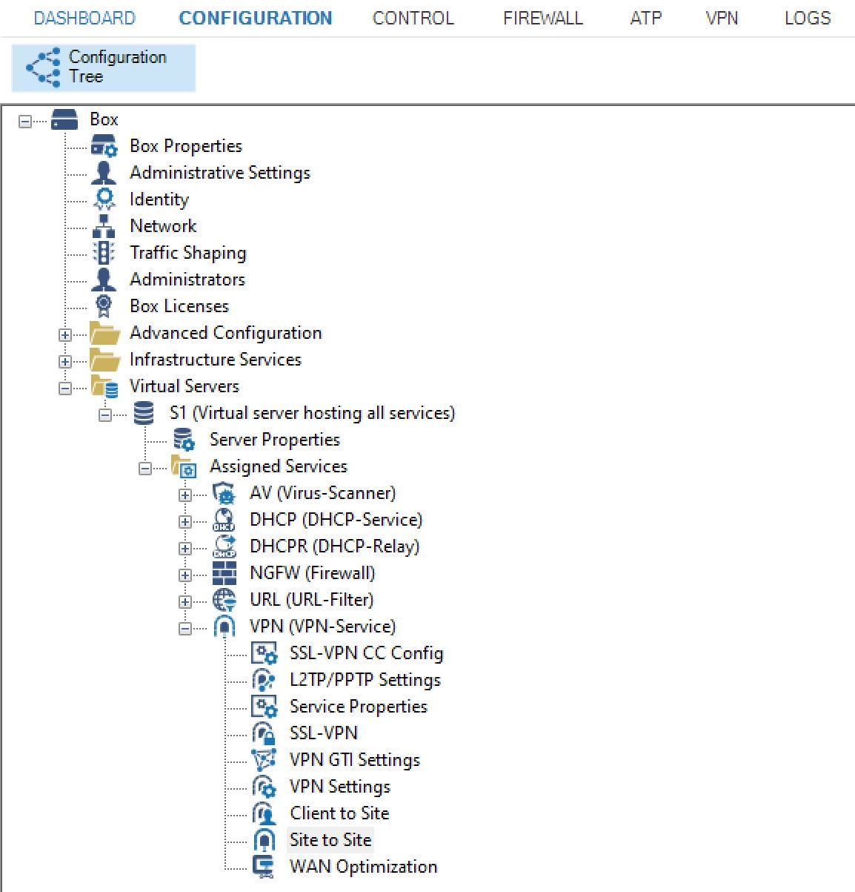
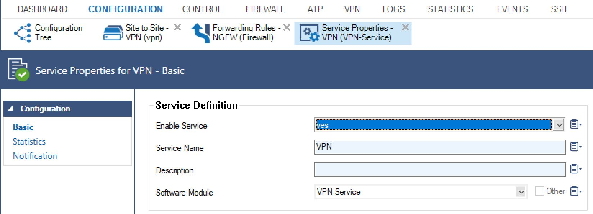

# Creating a Site-to-Site VPN from a Barracuda firewall to Azure 
The goal is to create a VPN between a local network and Azure, to secure the communication between the two environments. The Azure IP address space can be a public address space, where the various services are accessed using a public URL, or it can be a private address space (e.g 10.x.x.x), to further increase security. This document does not go into details of creating a Vnet in Azure or setting up DNS forwarders to resolve private URLs, it deals only with setting up the VPN with a Barracuda firewall.

## Tested firewall 
The configuration example in the sections below has been tested on the following device:

- Model: Barracuda F18
- Firmware version: 7.2.3-161
- Licensed software: ClougGen Firewall OS

## High level architecture 

**VPN architecture**

## In the Azure portal 

You need to create objects representing the Barracuda gateway, the Azure gateway, and the connection between them. The easiest way to do this is with the Azure template to create a Site-to-Site VPN:

        

In the wizard enter the following:

- Vpn Type: **Route-based**
- Local virtual network gateway: **24.x.x.x** (Barracuda external interface IP (Public IP address)
- Azure Gateway Public IP Address: **40.x.x.x**
- Local Network Address: **192.168.0.0/16** (On-premises local network. Specify starting IP address of your network.) 
- Azure VNet Address: **40.0.0.0/16**
- Shared Key: **s30keBEOikz5Orl1GYI8not22dbnuZCJ**

After the deployment is finished, review the three items created. Screens:

    

    **The Azure gateway**

    

    **The local gateway**

    

    **The connection between them**

Once the Azure deployment is done, you can configure the Barracuda firewall.

## In the Barracuda firewall administration tool

Barracuda guidance can be found [here](https://campus.barracuda.com/product/cloudgenfirewall/doc/73719171/how-to-configure-an-ikev2-ipsec-site-to-site-vpn-to-a-routed-based-microsoft-azure-vpn-gateway/)

Start by logging in to the Barracuda firewall as administrator

**Barracuda CloudGen Firewall login screen**

Next, configure the following items:

### IPSec Tunnel

- Open Configuration Tree &#10132; Box &#10132; Virtual Servers &#10132; \<virtual server \> &#10132; Assigned Services &#10132; VPN-Service &#10132; 
- Double-click on Site to Site
 
    

- Select IPSec IKEv2 Tunnels tab
- Right click in white space, select "New IPSec IKEv2 Tunnel"
- Sample entries
    - Local gateway: 0.0.0.0 
    - Network address: 192.168.0.0/16 (IP range in local network)
    - Remote gateway: 40.x.x.x (Azure Gateway public IP address) 
    - Network address: 10.2.0.0/16 (IP range in Azure that this gateway serves, here shown as a private VNET address, but does not have to be)
    - Shared secret: xxxxxxxxx (from Azure VPN Gateway configuration above)
    - Enabled: yes
- Screens

        

        **New IPSec IKEv2 Tunnel entry screen, top**

        

        **New IPSec IKEv2 Tunnel entry screen, bottom**

### Forwarding Rule for traffic from local network to Azure

- Open Configuration Tree &#10132; Box &#10132; Virtual Servers &#10132; \<virtual server \> &#10132; Assigned Services &#10132; NGFW (Firewall) &#10132; Forwarding Rules 
- Create new forwarding rule
- Example entries
    - Source: Trusted LAN
    - Service: Any
    - Destination: 10.2.0.0/16 (IP range in Azure that the gateway serves, here shown as a private VNET address, but does not have to be)
- Activated: yes
- Screen:

    

    **New outbound Forwarding Rule entry screen**

### Forwarding Rule for traffic from Azure to local network 
- Open Configuration Tree &#10132; Box &#10132; Virtual Servers &#10132; \<virtual server \> &#10132; Assigned Services &#10132; NGFW (Firewall) &#10132; Forwarding Rules 
- Create new forwarding rule
- Example entries
    - Source: Internet
    - Service: IPSEC-VPN
    - Destination: <explicit-dest> 24.x.x.x (Public IP of Barracuda)
- Activated: yes
- Screen:

    

    **New inbound Forwarding Rule entry screen**

### Service properties

- Open Configuration Tree &#10132; Box &#10132; Virtual Servers &#10132;  \<virtual server \> &#10132; Assigned Services &#10132; VPN (VPN-Service ) &#10132;  Service Properties
- Enable VPN service
- Screen:

    

    **Service properties entry screen**

